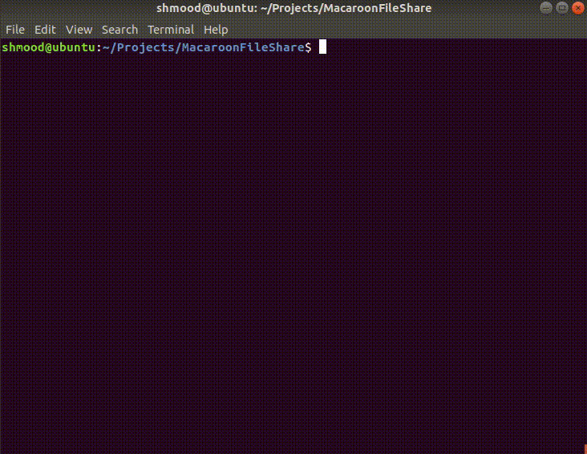
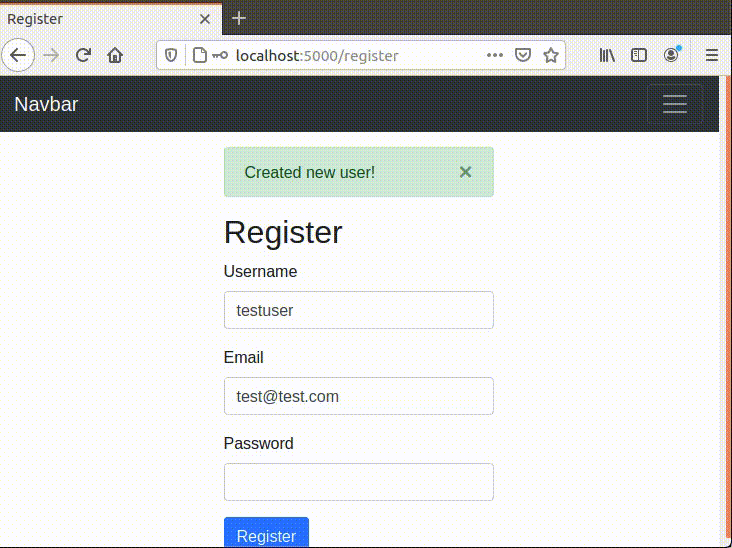
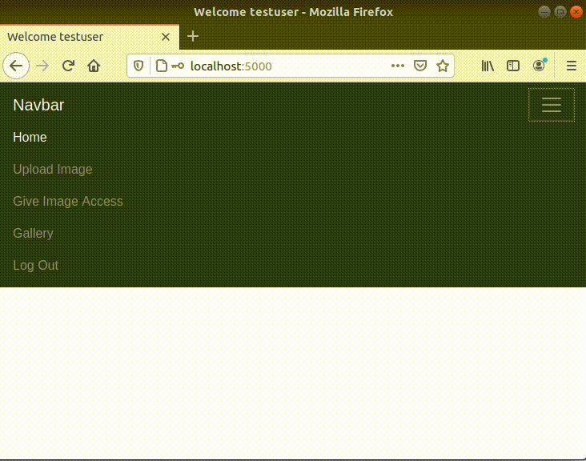
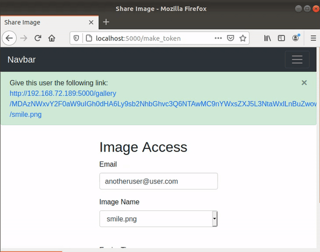
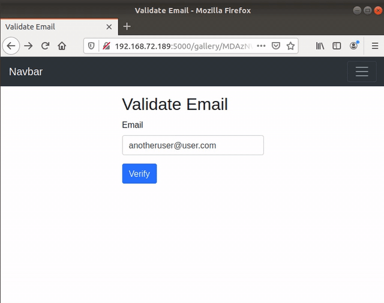

# MacaroonFileShare

This repository was created to demonstrate a simple application of using Google Macaroons. The application enables a user to create an account, login, upload images and give a user who does not have an account access an image for a certain period of time.

# What Are Macaroons?

Macaroons are access tokens that use caveats to ensure a user is who they say they are. They were created by individuals at Google in 2014, the research paper can be found [here](https://storage.googleapis.com/pub-tools-public-publication-data/pdf/41892.pdf). Macaroons are essentially cookies that help reduce the scope of a token. With caveats, it further allows users to restrict the scope. With the use of caveats it makes delegation easy. In this applicaiton, caveats are used to reduce the scope of the token to a given users email address, the image being shared and an expiry. If any of these caveats are not met, the token is considered invalid, and the image being shared will not be accessible to the user with the link.

Further information on Google Macaroons can be found at the following links:
* [https://securityboulevard.com/2020/05/cloud-series-authorize-anyone-anything-with-macaroons/](https://securityboulevard.com/2020/05/cloud-series-authorize-anyone-anything-with-macaroons/)
* [https://hackingdistributed.com/2014/05/16/macaroons-are-better-than-cookies/](https://hackingdistributed.com/2014/05/16/macaroons-are-better-than-cookies/)

There also exists a [playground](http://macaroons.io/) that can be used to test and fiddle with these tokens.

# Packages Needed

To properly run the application, the following packages are required:
* `pip3 install flask`
* `pip3 install flask-login`
* `pip3 install flask-sqlalchemy`
* `pip3 install flask-reuploaded`
* `pip3 install flask-wtforms`
* `pip3 install pymacaroons`
* `pip3 install email_validator`

# Installation

The easiest way to ensure all of the packages needed are installed is to run the following command within `~/Projects/MacaroonFileShare` folder:

* `pip3 install -r requirements.txt`

# Running

In order to run the application direct yourself to the project file:
* `$ cd ~/Projects/MacaroonFileshare`

Once in the proper directory, the sqlite3 database needs to be created. To do this, run the following:
* `$ sqlite3 login.db`

Once created, you have to ensure the `users` database table is successfully created, to do this run:
* `$ python3`
* `>>> from models import db`
* `>>> db.create_all()`

Once the table is created, you can run the entire project with:
* `python3 app.py`

Once up and running, direct yourself to `http://localhost:5000/register` to create a user.

We can further verify the user was successfully by checking the database we created. To do this, run the following command:
* `$ sqlite3 login.db`
* `sqlite> select * from user;`

Now that the user has successfully been added to the database, you can proceed with logging in and using the application.

# Creating A Macaroon
The creation of the Google Macaroon takes place when a user clicks on the `Give Image Access` button in the menu. You will be asked to provide a user email, choose the image you would like to share with them as well as how long the link generated will be active for.

Obviously, prior to sharing an image with someone, you must first uploaded an image using the `Upload Image` button.

Once the Macaroon has been created, the link that's generated would (in theory) be sent to `anotheruser@user.com` so they can access the picture you would like to share with them! The user in no way has to register on the website, all they have to do is enter in their email address to view the image (until the expiry time you chose runs out).

Once the 2 minute expiry we set in the example expires, the user is no longer able to access the image shared with them.

