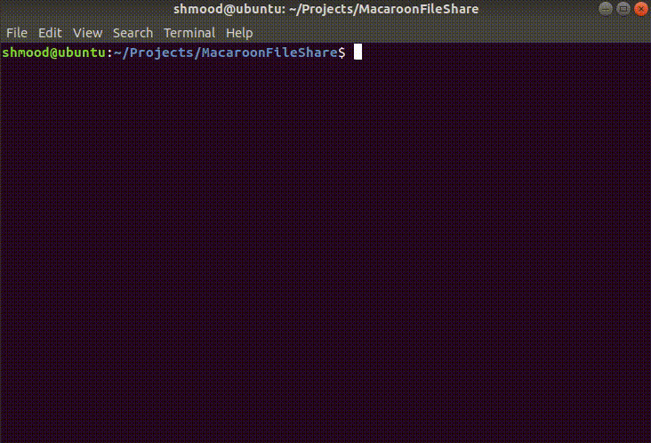

# MacaroonFileShare

This repository was created to demonstrate a simple application of using Google Macaroons. The application enables a user to create an account, login, upload images and give a user who does not have an account access to viewing an image for a certain period of time.

# Packages Needed

To properly run the application, the following packages are required:
* `pip3 install flask`
* `pip3 install flask-login`
* `pip3 install flask-sqlalchemy`
* `pip3 install flask-reuploaded`
* `pip3 install flask-wtforms`
* `pip3 install pymacaroons`
* `pip3 install email_validator`

# Installation

The easiest way to ensure all of the packages needed are installed is to run the following command within `~/Projects/MacaroonFileShare` folder:

`sudo pip3 install -r requirements.txt`

# Running

In order to run the application direct yourself to the project file:
* `$ cd ~/Projects/MacaroonFileshare`

Once in the proper directory, the sqlite3 database needs to be created. To do this, run the following:
* `$ sqlite3 login.db`

Once created, you have to ensure the `users` database table is successfully created, to do this run:
* `$ python3`
* `$ from models import db`
* `$ db.create_all()`

Here's a GIF outlining the creation of the database:

Once the table is created, you can run the entire project with:
* `python3 app.py`

Once up and running, direct yourself to `http://localhost:5000/register` to create a user.

We can further verify the user was successfully by checking the database we created. To do this, run the following command:
* `$ sqlite3 login.db`
* `sqlite> select * from user;`

